# Praktikum MP #04 – App Navigation (Navio)

## 📱 Menggunakan Navigasi Aplikasi (Explicit & Implicit Intents, Compose Navigation, Fragment)

---

## 📌 Deskripsi Praktikum

Praktikum ini membahas **implementasi navigasi aplikasi Android modern** menggunakan **Jetpack Compose Navigation**. Aplikasi yang dibangun bernama **Navio**, yang mendemonstrasikan berbagai konsep navigasi seperti:

* Navigasi antar layar (screen)
* Explicit Intent & pengiriman data
* Back Stack Navigation
* Bottom Navigation (Fragment-style)
* Parameterized navigation
* Material Design 3

---

## 🎯 Tujuan Praktikum

1. Memahami navigasi antar Activity menggunakan Intent eksplisit
2. Mengirim dan menerima data antar layar
3. Memahami Activity & Navigation Back Stack
4. Mengimplementasikan multi-step navigation
5. Menggunakan Jetpack Compose Navigation
6. Menggabungkan Activity dengan Fragment-style navigation
7. Mengelola state navigasi dengan benar

---

## 🛠️ Tools & Teknologi

* Android Studio (Narwhal | 2025.1.1)
* Kotlin
* Jetpack Compose
* Material Design 3
* Navigation Compose
* DataStore Preferences
* Android Emulator / Device

---

## 📂 Struktur Project

```
app/
├── data/
├── nav/
│   ├── Routes.kt
│   └── NavGraph.kt
├── screens/
│   ├── HomeScreen.kt
│   ├── ActivityA_B.kt
│   ├── ActivityC_D.kt
│   ├── BackStackScreens.kt
│   └── HubScreens.kt
├── viewmodel/
├── ui/theme/
└── screenshots/
```

---

## ▶️ Cara Menjalankan Aplikasi

1. Buka project di Android Studio
2. Pastikan Gradle sync berhasil
3. Jalankan aplikasi di emulator atau device
4. Aplikasi akan menampilkan Home dengan judul **Navio**

---

## 🧭 Alur Navigasi Aplikasi

* **Home**

    * Start Activity (Activity A → B)
    * Send Data (Activity C → D)
    * Back Stack Demo (Step 1 → 2 → 3)
    * Activity + Fragment (Hub)

---

## 🧪 Hasil Screenshot Navigasi Aplikasi


### 1️⃣ Home Screen


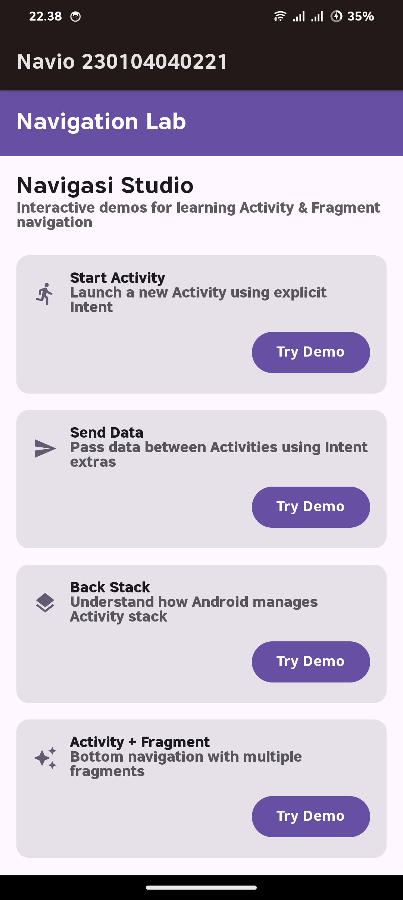

---

### 2️⃣ Activity A


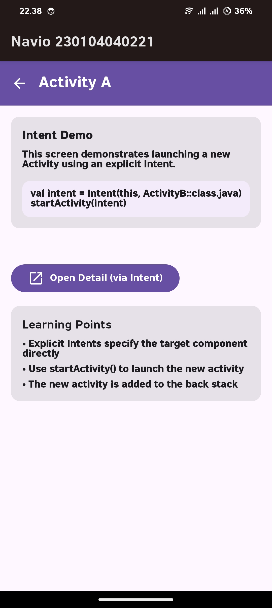

---

### 3️⃣ Activity B


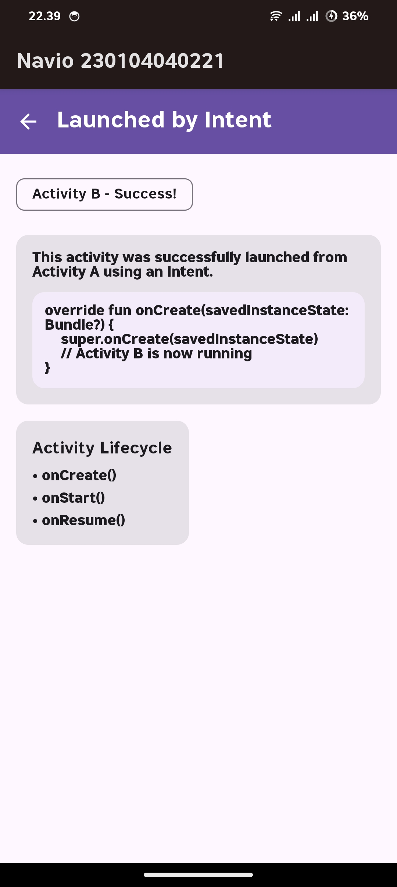

---

### 4️⃣ Activity C (Form Input)


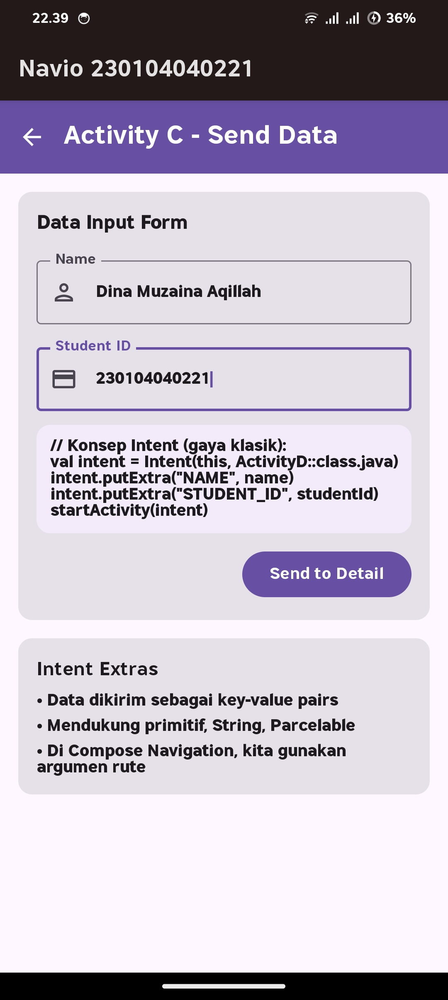

---

### 5️⃣ Activity D (Result)


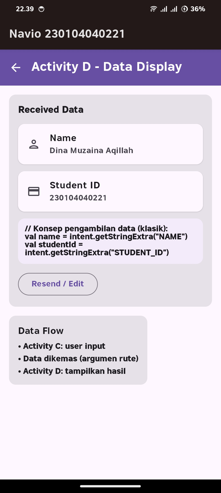

---

### 6️⃣ Back Stack – Step 1


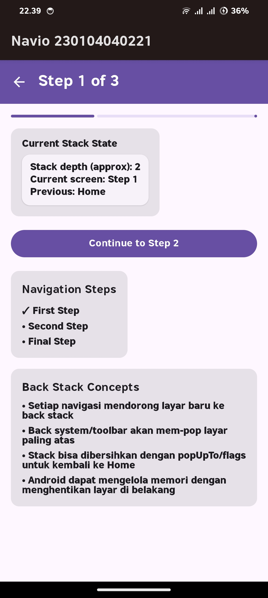

---

### 7️⃣ Back Stack – Step 2


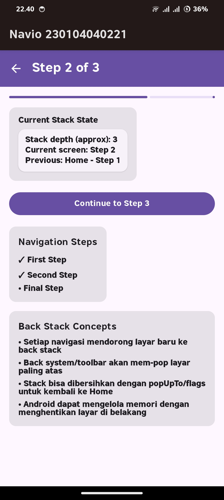

---

### 8️⃣ Back Stack – Step 3


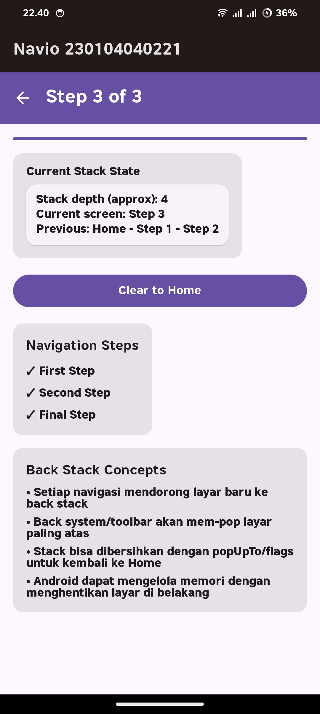

---

### 9️⃣ Hub – Dashboard Fragment


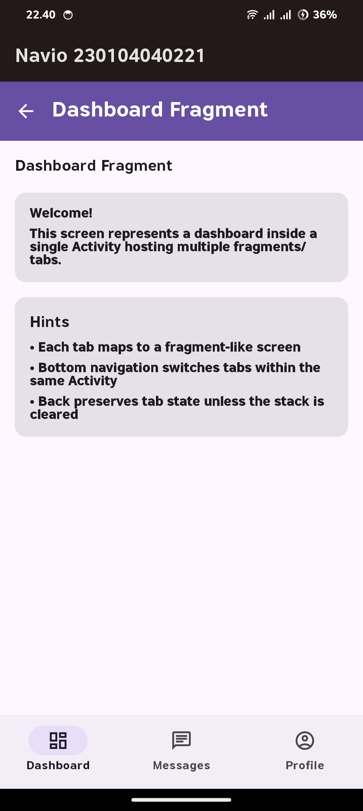

---

### 🔟 Hub – Messages Fragment


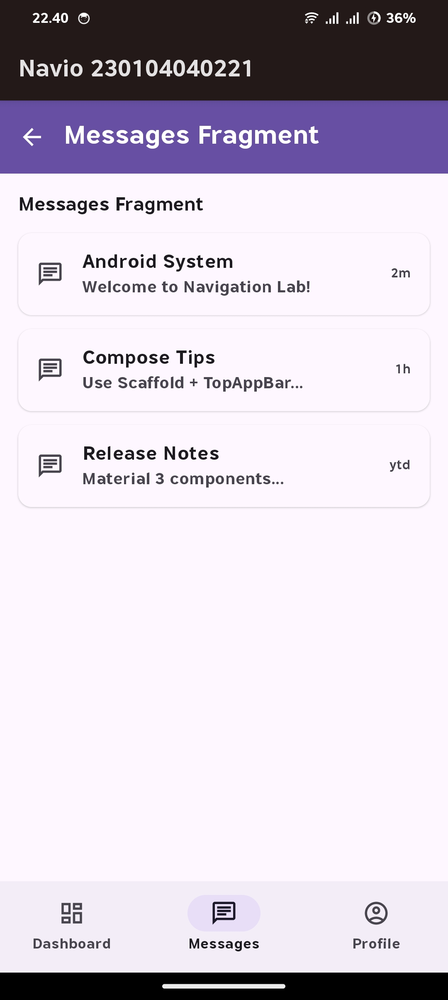

---

### 1️⃣1️⃣ Message Detail Screen


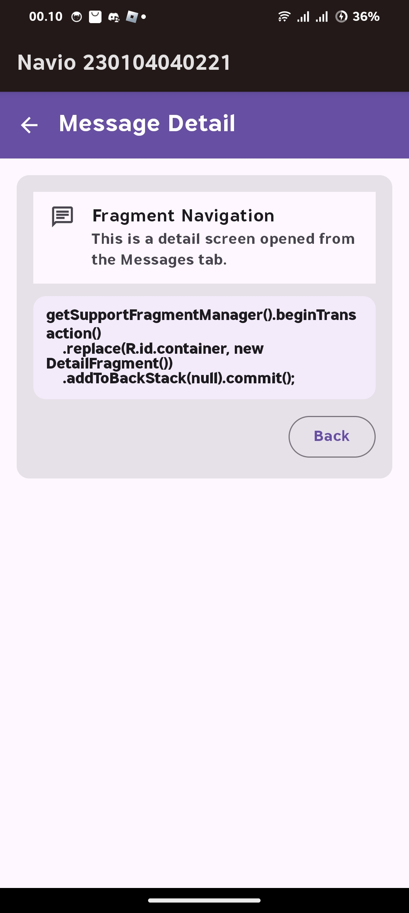

---

### 1️⃣2️⃣ Profile Fragment


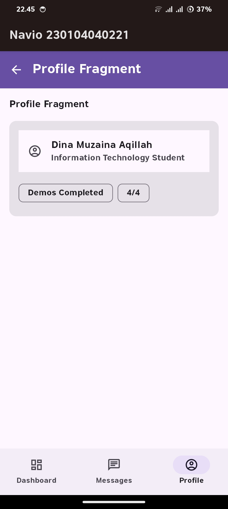

---

## ✅ Checklist Praktikum

* [x] Jetpack Compose Navigation
* [x] Explicit Intent
* [x] Data Passing antar layar
* [x] Back Stack Navigation
* [x] Multi-step Navigation
* [x] Bottom Navigation (Hub)
* [x] Parameterized Navigation
* [x] Material Design 3
* [x] Screenshot Navigasi Lengkap

---

## 👨‍🎓 Identitas Praktikum

* **Mata Kuliah** : Mobile Programming
* **Modul** : Praktikum MP #04 – App Navigation
* **Aplikasi** : Navio
* **Dosen Pengampu** : Muhayat, M.IT

---

✍️ *README ini dibuat sebagai dokumentasi resmi Praktikum MP #04 Mobile Programming.*
